# Pulse Microservices Architecture Diagram

## Updated System Architecture

```mermaid
graph TB
    subgraph "Client Layer"
        Client[Client/Frontend<br/>localhost:3000]
        Mobile[Mobile App<br/>iOS/Android]
    end

    subgraph "API Gateway Layer"
        Kong[Kong API Gateway<br/>:8000<br/>DB-less Mode]
    end

    subgraph "Microservices Layer"
        UserService[User Service<br/>Node.js + Prisma<br/>:8081<br/>Authentication & User Management]
        PostService[Post Service<br/>Go<br/>:8082<br/>Posts, Likes & Content]
        SocialService[Social Service<br/>Node.js + Prisma<br/>:8085<br/>Follow & Recommendations]
        MessagingService[Messaging Service<br/>Go<br/>:8084<br/>Real-time Chat & WebSocket]
        NotificationService[Notification Service<br/>Node.js<br/>:8086<br/>Push Notifications]
    end

    subgraph "Data Layer"
        subgraph "PostgreSQL :5432"
            UserDB[(pulse_users DB<br/>User Auth & Profiles)]
            PostDB[(pulse_posts DB<br/>Posts & Interactions)]
            SocialDB[(pulse_social DB<br/>Relationships & Feeds)]
        end
        
        subgraph "MongoDB :27017"
            MessageDB[(messaging_db<br/>Messages & Conversations)]
            NotificationDB[(pulse_notifications<br/>Notification History)]
        end
        
        Redis[(Redis :6379<br/>Caching & Sessions)]
    end

    subgraph "Message Queue Layer"
        RabbitMQ[(RabbitMQ :5672<br/>Event Messaging<br/>Management UI :15672)]
    end

    subgraph "CI/CD & Quality"
        GitHubActions[GitHub Actions<br/>Matrix CI/CD<br/>Multi-version Testing]
        SonarQube[SonarQube<br/>:9001<br/>Code Quality Analysis]
    end

    subgraph "Infrastructure"
        Docker[Docker Compose<br/>Container Orchestration]
        Monitoring[Health Checks<br/>Structured Logging<br/>Metrics Endpoints]
    end

    %% Client connections
    Client -->|HTTP/HTTPS Requests| Kong
    Mobile -->|API Calls| Kong

    %% Kong routes to services
    Kong -->|/api/v1/auth<br/>/api/v1/users| UserService
    Kong -->|/api/v1/posts| PostService
    Kong -->|/api/v1/social| SocialService
    Kong -->|/api/v1/messages<br/>/ws| MessagingService
    Kong -->|/api/notifications| NotificationService

    %% Service to Database connections
    UserService -->|Prisma ORM| UserDB
    PostService -->|Database Driver| PostDB
    SocialService -->|Prisma ORM| SocialDB
    MessagingService -->|MongoDB Driver| MessageDB
    NotificationService -->|MongoDB Driver| NotificationDB

    %% Redis connections
    UserService -->|Session Cache| Redis
    SocialService -->|Feed Cache| Redis
    MessagingService -->|Presence Tracking| Redis
    NotificationService -->|Rate Limiting| Redis

    %% RabbitMQ event connections
    UserService -.->|user.registered<br/>user.updated| RabbitMQ
    PostService -.->|post.created<br/>post.liked| RabbitMQ
    SocialService -.->|follow.created<br/>feed.updated| RabbitMQ
    MessagingService -.->|message.sent<br/>user.online| RabbitMQ
    NotificationService -.->|notification.sent| RabbitMQ

    %% Service-to-Service communication
    PostService -.->|Fetch User Data| UserService
    SocialService -.->|User Validation| UserService
    MessagingService -.->|User Authentication| UserService
    NotificationService -.->|User Preferences| UserService

    %% CI/CD connections
    GitHubActions -.->|Code Quality| SonarQube
    GitHubActions -.->|Deploy| Docker

    %% Infrastructure monitoring
    Monitoring -.->|Health Checks| UserService
    Monitoring -.->|Health Checks| PostService
    Monitoring -.->|Health Checks| SocialService
    Monitoring -.->|Health Checks| MessagingService
    Monitoring -.->|Health Checks| NotificationService

    %% Styling
    classDef serviceStyle fill:#4A90E2,stroke:#2E5C8A,stroke-width:2px,color:#fff
    classDef dbStyle fill:#50C878,stroke:#2E7D4E,stroke-width:2px,color:#fff
    classDef gatewayStyle fill:#FF6B6B,stroke:#C44D4D,stroke-width:3px,color:#fff
    classDef clientStyle fill:#FFD93D,stroke:#C4A02D,stroke-width:2px,color:#333
    classDef cicdStyle fill:#9370DB,stroke:#6A4CA5,stroke-width:2px,color:#fff
    classDef infraStyle fill:#20B2AA,stroke:#008B8B,stroke-width:2px,color:#fff
    classDef mqStyle fill:#FF8C00,stroke:#FF7F00,stroke-width:2px,color:#fff

    class UserService,PostService,SocialService,MessagingService,NotificationService serviceStyle
    class UserDB,PostDB,SocialDB,MessageDB,NotificationDB,Redis dbStyle
    class Kong gatewayStyle
    class Client,Mobile clientStyle
    class GitHubActions,SonarQube cicdStyle
    class Docker,Monitoring infraStyle
    class RabbitMQ mqStyle
```

## Key Architecture Features

### 🔄 **Event-Driven Architecture**
- **RabbitMQ** handles asynchronous communication between services
- Services publish events for loose coupling
- Event types: `user.*`, `post.*`, `social.*`, `message.*`, `notification.*`

### 📊 **Multi-Database Strategy**
- **PostgreSQL**: Relational data (users, posts, social relationships)
- **MongoDB**: Document storage (messages, notifications)
- **Redis**: High-speed caching and session management

### 🚀 **Real-Time Features**
- **WebSocket** support in Messaging Service
- **Presence tracking** via Redis
- **Typing indicators** and **read receipts**

### 🔒 **Security & Authentication**
- **JWT-based** authentication across all services
- **CORS** configuration via Kong
- **Rate limiting** and **input validation**

### 📈 **Observability**
- **Metrics endpoints** at `/metrics` (Prometheus format)
- **Structured logging** with Zap (Go) and Winston (Node.js)
- **Health checks** and **readiness probes**

### 🏗️ **CI/CD Pipeline**
- **GitHub Actions** with matrix strategy
- **Multi-version testing** (Node 18/20, Go 1.21/1.22)
- **Docker image** validation and **security scanning**

### 🔧 **Infrastructure**
- **Docker Compose** for local development
- **Kong API Gateway** in DB-less mode
- **Container orchestration** with health checks
