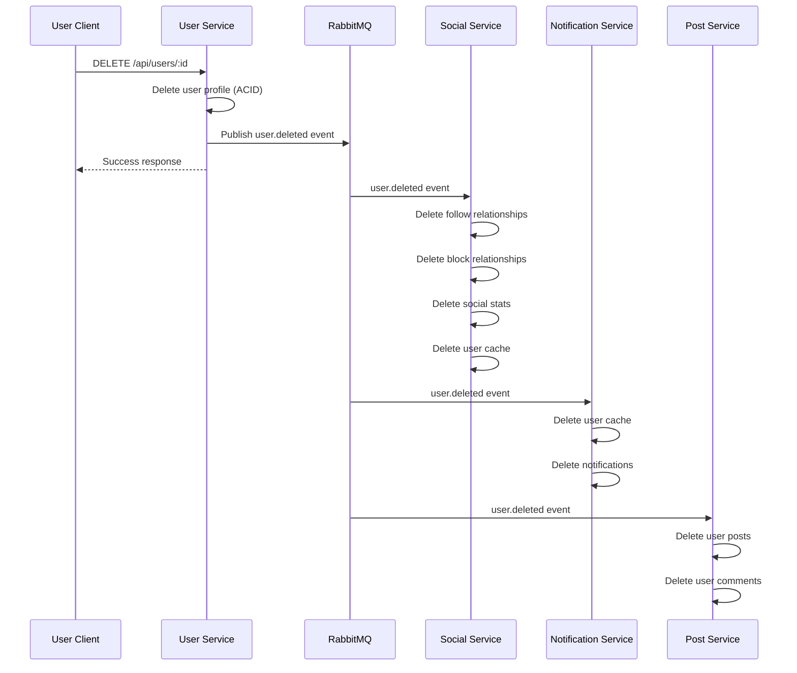

# Saga Pattern Implementation

## Overview

This document describes the Saga pattern implementation in the Pulse microservices platform for managing distributed transactions across multiple services. The Saga pattern is used to maintain data consistency in distributed systems where traditional ACID transactions are not feasible across service boundaries.

The Saga pattern breaks down a distributed transaction into a series of local transactions, each with a compensating transaction that can undo its effects if the saga fails. In the Pulse platform, the Saga pattern is implemented using an event-driven choreography approach, where services communicate through events published to RabbitMQ.

## Why Saga Pattern?

### Requirements
- Distributed transactions across multiple services
- Eventual consistency for cross-service operations
- Resilience to service failures
- Loose coupling between services

### Why Saga Pattern Chosen
- **No Distributed Locks**: Avoids the complexity and performance issues of distributed locking
- **Eventual Consistency**: Acceptable for non-critical operations like user deletion cleanup
- **Service Independence**: Each service manages its own data and cleanup logic
- **Scalability**: Services can process events asynchronously without blocking

## Implementation Status

**Current Status**: ⚠️ **PARTIALLY IMPLEMENTED**

### ✅ Implemented
- Event consumers in multiple services (social-service, notification-service)
- Event-driven cleanup logic
- RabbitMQ message broker for event distribution
- Idempotent event handlers

### ⚠️ Partially Implemented
- User deletion saga orchestration (event publishing missing from user-service)
- Compensating transactions (not implemented)

### 📋 Planned
- Complete saga orchestration with event publishing
- Compensating transaction implementation
- Saga state management and monitoring
- Saga timeout and retry mechanisms

## Use Cases

### Primary Use Case: User Deletion

When a user requests account deletion, data must be removed from multiple services:
1. **User Service**: Delete user profile (ACID transaction)
2. **Social Service**: Delete follow relationships, blocks, social stats, user cache
3. **Notification Service**: Delete user cache and notifications
4. **Post Service**: Delete user posts and comments (planned)
5. **Messaging Service**: Delete user messages (planned)
6. **Event Service**: Delete user event RSVPs (planned)

**Consistency Model**: Eventual consistency - user profile deleted immediately, other services clean up asynchronously.

## Architecture

### Event-Driven Choreography Pattern

The Pulse platform uses a **choreography-based saga** where:
- Each service listens for events and performs its local transaction
- No central orchestrator coordinates the saga
- Services are loosely coupled through events
- Each service is responsible for its own cleanup logic

**Event Flow**:
```
User Service (deleteUser)
    ↓
[Missing: Event Publishing]
    ↓
RabbitMQ (user.deleted event)
    ↓
    ├─→ Social Service (handleUserDeleted)
    ├─→ Notification Service (handleUserDeleted)
    └─→ [Other services...]
```

## Implementation Details

### Current Implementation

#### 1. User Service - Deletion Endpoint

**Location**: `user-service/src/services/userService.ts`

**Current Implementation**:
```307:323:user-service/src/services/userService.ts
  async deleteUser(userId: string): Promise<{ message: string }> {
    try {
      await prisma.userProfile.delete({
        where: { id: userId },
      });

      logger.info('User deleted successfully', { userId });

      return { message: 'User account deleted successfully' };
    } catch (error: any) {
      logger.error('Delete user error:', error);
      if (error instanceof AppError) {
        throw error;
      }
      throw error;
    }
  }
```

**Status**: ⚠️ **INCOMPLETE** - Missing event publishing step

**Gap**: The `deleteUser` method does not publish a `user.deleted` event to RabbitMQ, so other services are not notified of the deletion.

#### 2. Social Service - Event Consumer

**Location**: `social-service/src/services/eventService.ts`

**Event Consumer Setup**:
```53:67:social-service/src/services/eventService.ts
  async startEventConsumers(): Promise<void> {
    // Listen for user.deleted events
    await consumeEvents(['user.deleted'], async (event: BaseEvent) => {
      await this.handleUserDeleted(event as unknown as UserDeletedEvent);
    });

    // Listen for user.created and user.updated events to sync user cache
    await consumeEvents(['user.created', 'user.updated'], async (event: BaseEvent) => {
      if (event.type === 'user.created') {
        await this.handleUserSync(event as unknown as UserCreatedEvent);
      } else if (event.type === 'user.updated') {
        await this.handleUserSync(event as unknown as UserUpdatedEvent);
      }
    });
  }
```

**Event Handler**:
```69:102:social-service/src/services/eventService.ts
  async handleUserDeleted(event: UserDeletedEvent): Promise<void> {
    try {
      const { userId } = event.data;
      logger.info(`Processing user.deleted event for user ${userId}`);

      // Delete all follow relationships
      await prisma.follow.deleteMany({
        where: {
          OR: [{ followerId: userId }, { followingId: userId }],
        },
      });

      // Delete all block relationships
      await prisma.block.deleteMany({
        where: {
          OR: [{ blockerId: userId }, { blockedId: userId }],
        },
      });

      // Delete social stats
      await prisma.userSocialStats.delete({
        where: { userId },
      }).catch(() => {}); // Ignore if not exists

      // Delete user cache
      await prisma.userCache.delete({
        where: { id: userId },
      }).catch(() => {}); // Ignore if not exists

      logger.info(`Successfully cleaned up data for deleted user ${userId}`);
    } catch (error) {
      logger.error('Error handling user.deleted event:', error);
    }
  }
```

**Status**: ✅ **IMPLEMENTED** - Event consumer and handler fully functional

**Operations Performed**:
- Deletes all follow relationships (where user is follower or following)
- Deletes all block relationships (where user is blocker or blocked)
- Deletes user social stats
- Deletes user cache entry

#### 3. Notification Service - Event Consumer

**Location**: `notification-service/src/services/eventService.ts`

**Event Handler**:
```220:236:notification-service/src/services/eventService.ts
  private async handleUserDeleted(data: Record<string, unknown>): Promise<void> {
    try {
      logger.logEventProcessing('user.deleted', 'started', { data });

      const eventData = data as unknown as UserDeletedEvent;

      // Remove user from cache
      await UserCache.findOneAndDelete({ user_id: eventData.user_id });

      logger.logEventProcessing('user.deleted', 'completed', { userId: eventData.user_id });
      metrics.incrementEventProcessingCounter('user.deleted', 'success');
    } catch (error) {
      logger.logError(error, { action: 'handleUserDeleted', data });
      metrics.incrementEventProcessingCounter('user.deleted', 'error');
      throw error;
    }
  }
```

**Status**: ✅ **IMPLEMENTED** - Event consumer and handler fully functional

**Operations Performed**:
- Deletes user cache entry from MongoDB
- Logs event processing with metrics

## Event Flow

### Current Flow (Incomplete)

```mermaid
sequenceDiagram
    participant User as User Client
    participant US as User Service
    participant RMQ as RabbitMQ
    participant SS as Social Service
    participant NS as Notification Service

    User->>US: DELETE /api/users/:id
    US->>US: Delete user profile (ACID)
    Note over US: Missing: Publish user.deleted event
    US-->>User: Success response
    Note over RMQ,SS,NS: Services not notified
```

### Intended Flow (Complete Saga)



## Compensating Transactions

### Current State

**Status**: ❌ **NOT IMPLEMENTED**

Currently, there is no mechanism to rollback or compensate for failed saga steps. If a service fails to process the `user.deleted` event, the user profile is already deleted, and there's no way to restore it.

### Planned Implementation

**Compensating Transaction Strategy**:

1. **Soft Delete First**: Instead of hard deleting the user profile, mark it as deleted
2. **Event Publishing**: Publish `user.deleted` event with user data
3. **Cleanup Phase**: Services process deletion events
4. **Confirmation Phase**: Services confirm cleanup completion
5. **Hard Delete**: After all services confirm, hard delete user profile
6. **Compensation**: If any service fails, restore user profile from soft-deleted state

**Example Compensating Transaction**:
```javascript
// Planned implementation
async deleteUser(userId: string): Promise<void> {
  try {
    // Step 1: Soft delete user profile
    await prisma.userProfile.update({
      where: { id: userId },
      data: { deletedAt: new Date(), status: 'DELETED' }
    });
    
    // Step 2: Publish deletion event
    await rabbitmq.publish('user.deleted', { userId });
    
    // Step 3: Wait for confirmations (with timeout)
    const confirmations = await waitForConfirmations(userId, ['social', 'notification', 'post'], 30000);
    
    if (confirmations.allConfirmed) {
      // Step 4: Hard delete user profile
      await prisma.userProfile.delete({ where: { id: userId } });
    } else {
      // Compensating transaction: Restore user
      await prisma.userProfile.update({
        where: { id: userId },
        data: { deletedAt: null, status: 'ACTIVE' }
      });
      throw new Error('Saga failed: Not all services confirmed deletion');
    }
  } catch (error) {
    // Compensating transaction: Restore user
    await restoreUser(userId);
    throw error;
  }
}
```

## Challenges and Limitations

### Current Limitations

1. **No Event Publishing**: User service doesn't publish `user.deleted` events, breaking the saga flow
2. **No Compensating Transactions**: Cannot rollback if saga fails
3. **No Saga State Management**: No tracking of saga progress or state
4. **No Timeout Handling**: No mechanism to handle services that don't respond
5. **No Retry Logic**: Failed event processing is not automatically retried
6. **No Saga Monitoring**: No visibility into saga execution status

### Challenges

1. **Eventual Consistency**: User data may be temporarily inconsistent across services
2. **Failure Handling**: If a service is down, cleanup may be delayed indefinitely
3. **Idempotency**: Event handlers must be idempotent to handle duplicate events
4. **Ordering**: Events must be processed in order (currently handled by RabbitMQ)

## Best Practices Applied

### ✅ Implemented

1. **Idempotent Event Handlers**: Event handlers can be safely retried
   - Social service uses `deleteMany` which is idempotent
   - Notification service uses `findOneAndDelete` which is idempotent

2. **Error Handling**: Event handlers catch and log errors
   - Errors don't crash the service
   - Failed events can be retried

3. **Logging**: Comprehensive logging for saga steps
   - Event processing start/completion logged
   - Errors logged with context

4. **Metrics**: Event processing metrics tracked
   - Success/failure counters
   - Processing latency

### ⚠️ Missing

1. **Event Publishing**: User service must publish events
2. **Compensating Transactions**: Rollback mechanism needed
3. **Saga State Management**: Track saga progress
4. **Timeout Handling**: Handle unresponsive services
5. **Dead Letter Queue**: Handle permanently failed events

## Future Enhancements

### 1. Complete Saga Orchestration

**Planned**: Implement event publishing in user service
- Add RabbitMQ client to user service
- Publish `user.deleted` event after profile deletion
- Add event publishing to other user operations (update, create)

**Benefits**:
- Complete saga flow
- All services notified of user changes
- Consistent data cleanup

### 2. Compensating Transactions

**Planned**: Implement rollback mechanism
- Soft delete before hard delete
- Confirmation mechanism from services
- Automatic rollback on failure

**Benefits**:
- Data consistency guaranteed
- Ability to recover from failures
- Better error handling

### 3. Saga State Management

**Planned**: Track saga execution state
- Saga state store (Redis or database)
- Track which services have processed events
- Saga completion status

**Benefits**:
- Visibility into saga progress
- Ability to resume failed sagas
- Better monitoring and debugging

### 4. Saga Timeout and Retry

**Planned**: Handle timeouts and retries
- Configurable timeouts per saga step
- Automatic retry with exponential backoff
- Dead letter queue for failed events

**Benefits**:
- Resilience to temporary failures
- Better handling of slow services
- Automatic recovery

### 5. Saga Monitoring

**Planned**: Comprehensive saga monitoring
- Saga execution metrics
- Saga duration tracking
- Failure rate monitoring
- Alerting on saga failures

**Benefits**:
- Better observability
- Proactive issue detection
- Performance optimization

## Validation

### Testing Status

**Event Consumers**: ✅ Tested
- Social service event handler tested
- Notification service event handler tested
- Event processing validated

**Event Publishing**: ❌ Not tested (not implemented)
- User service event publishing missing
- Integration tests needed

**Compensating Transactions**: ❌ Not tested (not implemented)
- Rollback mechanism not implemented
- Failure scenarios not tested

### Monitoring

**Metrics Available**:
- Event processing success/failure counts
- Event processing latency
- Event queue depth

**Metrics Missing**:
- Saga completion rate
- Saga duration
- Compensating transaction rate
- Saga failure rate

## References

- **Data Consistency Patterns**: @Design/Data-Consistency-Patterns.md
- **GDPR Compliance**: @LO7-Distributed-Data/GDPR-Compliance-Implementation.md
- **Social Service Event Handler**: @social-service/src/services/eventService.ts
- **Notification Service Event Handler**: @notification-service/src/services/eventService.ts
- **User Service Deletion**: @user-service/src/services/userService.ts

## Conclusion

The Saga pattern is partially implemented in the Pulse microservices platform using an event-driven choreography approach. Event consumers are functional in social-service and notification-service, but the orchestration is incomplete as the user-service does not publish deletion events. 

The current implementation provides eventual consistency for user deletion across services, but lacks compensating transactions and saga state management. Future enhancements should focus on completing the saga orchestration, implementing compensating transactions, and adding comprehensive monitoring and error handling.

**Overall Status**: ⚠️ **PARTIALLY IMPLEMENTED** - Core event consumers functional, but orchestration and compensating transactions missing.
