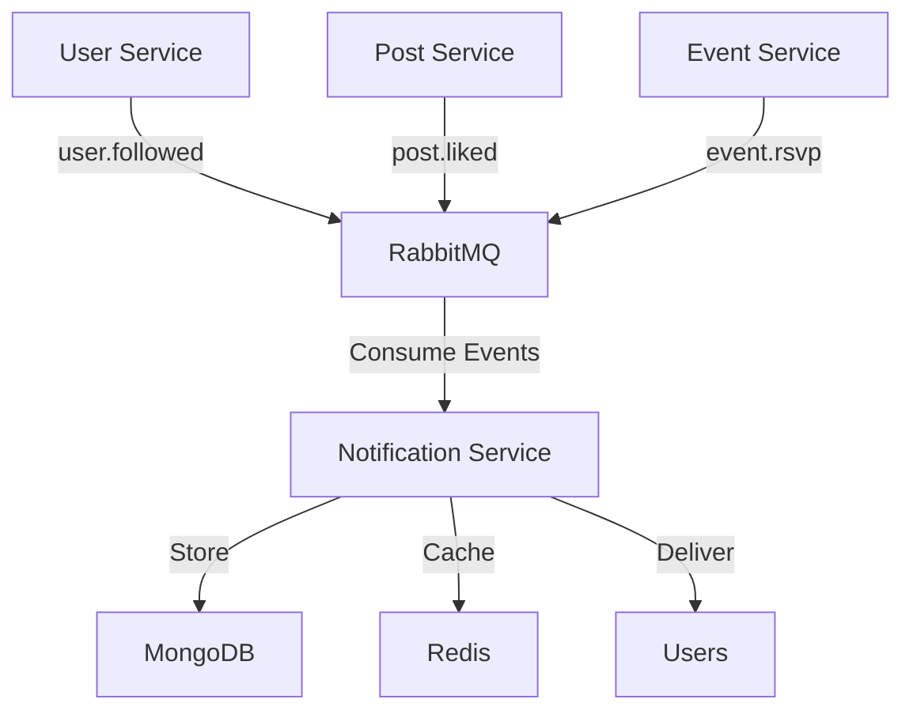

# Pulse Notification Service

A comprehensive notification microservice for the Pulse social media platform that handles real-time notifications, user preferences, and event-driven notification processing.

## 🚀 Features

- **Real-time Notifications**: Process and deliver notifications in real-time
- **Event-Driven Architecture**: Consumes events from RabbitMQ to create notifications
- **User Preferences**: Granular notification preferences with quiet hours
- **Multiple Notification Types**: Support for follows, likes, comments, messages, events, and more
- **Caching**: Redis-based caching for improved performance
- **Metrics & Monitoring**: Comprehensive Prometheus metrics
- **Rate Limiting**: Built-in rate limiting for API protection
- **Health Checks**: Health and readiness endpoints for monitoring
- **Comprehensive Testing**: 80%+ test coverage with Jest

## 📋 Table of Contents

- [Quick Start](#quick-start)
- [API Documentation](#api-documentation)
- [Configuration](#configuration)
- [Development](#development)
- [Testing](#testing)
- [Deployment](#deployment)
- [Architecture](#architecture)
- [Contributing](#contributing)

## 🚀 Quick Start

### Prerequisites

- Node.js 18+ 
- MongoDB 5.0+
- Redis 6.0+
- RabbitMQ 3.8+

### Installation

1. **Clone and setup**
   ```bash
   cd notification-service
   npm install
   ```

2. **Environment configuration**
   Create a `.env` file with your configuration (see Configuration section below).

3. **Start the service**
   ```bash
   npm run dev
   ```

The service will start on `http://localhost:8086`

### Docker

```bash
# Build image
docker build -t pulse-notification-service .

# Run container
docker run -p 8086:8086 --env-file .env pulse-notification-service
```

## 📚 API Documentation

### Base URL
```
http://localhost:8086
```

### Authentication
All endpoints require JWT authentication via Bearer token:
```
Authorization: Bearer <your-jwt-token>
```

### Endpoints

#### Notifications

| Method | Endpoint | Description |
|--------|----------|-------------|
| GET | `/api/notifications` | Get user notifications with pagination |
| GET | `/api/notifications/unread-count` | Get unread notification count |
| GET | `/api/notifications/stats` | Get notification statistics |
| PUT | `/api/notifications/:id/read` | Mark notification as read |
| PUT | `/api/notifications/read-all` | Mark all notifications as read |
| DELETE | `/api/notifications/:id` | Delete a notification |
| DELETE | `/api/notifications/cleanup` | Cleanup old notifications |

#### Notification Preferences

| Method | Endpoint | Description |
|--------|----------|-------------|
| GET | `/api/notifications/preferences` | Get user notification preferences |
| PUT | `/api/notifications/preferences` | Update notification preferences |

#### System

| Method | Endpoint | Description |
|--------|----------|-------------|
| GET | `/health` | Health check |
| GET | `/ready` | Readiness check |
| GET | `/metrics` | Prometheus metrics |
| GET | `/api-docs` | Swagger documentation |

### Example Requests

#### Get Notifications
```bash
curl -H "Authorization: Bearer <token>" \
     "http://localhost:8086/api/notifications?page=1&limit=10&unread_only=true"
```

#### Update Preferences
```bash
curl -X PUT \
     -H "Authorization: Bearer <token>" \
     -H "Content-Type: application/json" \
     -d '{"email_notifications": false, "preferences": {"FOLLOW": {"email": false}}}' \
     "http://localhost:8086/api/notifications/preferences"
```

## ⚙️ Configuration

### Environment Variables

| Variable | Description | Default |
|----------|-------------|---------|
| `PORT` | Service port | `8086` |
| `NODE_ENV` | Environment | `development` |
| `MONGODB_URI` | MongoDB connection string | `mongodb://localhost:27017/pulse_notifications` |
| `REDIS_URL` | Redis connection string | `redis://localhost:6379` |
| `RABBITMQ_URL` | RabbitMQ connection string | `amqp://localhost:5672` |
| `JWT_SECRET` | JWT secret key | `your-secret-key` |
| `CORS_ORIGIN` | CORS allowed origin | `http://localhost:3000` |
| `LOG_LEVEL` | Logging level | `info` |

### Database Schema

#### Notifications Collection
```javascript
{
  recipient_id: String,      // User ID receiving notification
  sender_id: String,         // User ID sending notification (optional)
  type: String,              // Notification type (FOLLOW, LIKE, etc.)
  title: String,             // Notification title
  message: String,           // Notification message
  reference_id: String,      // Related resource ID (optional)
  reference_type: String,    // Resource type (POST, EVENT, etc.)
  is_read: Boolean,          // Read status
  read_at: Date,             // Read timestamp
  priority: String,          // Priority level
  metadata: Object,          // Additional data
  created_at: Date,          // Creation timestamp
  updated_at: Date           // Last update timestamp
}
```

#### Notification Preferences Collection
```javascript
{
  user_id: String,           // User ID
  email_notifications: Boolean,
  push_notifications: Boolean,
  in_app_notifications: Boolean,
  preferences: {             // Per-type preferences
    [type]: {
      email: Boolean,
      push: Boolean,
      in_app: Boolean
    }
  },
  quiet_hours: {
    enabled: Boolean,
    start_time: String,      // HH:MM format
    end_time: String,        // HH:MM format
    timezone: String
  }
}
```

## 🛠 Development

### Project Structure
```
notification-service/
├── src/
│   ├── controllers/         # Request handlers
│   ├── models/             # Database models
│   ├── services/           # Business logic
│   ├── middleware/         # Express middleware
│   ├── routes/             # API routes
│   ├── config/             # Configuration
│   └── utils/              # Utilities
├── tests/                  # Test files
├── logs/                   # Log files
├── Dockerfile             # Docker configuration
├── package.json           # Dependencies
└── README.md              # This file
```

### Available Scripts

```bash
npm start          # Start production server
npm run dev        # Start development server with nodemon
npm test           # Run tests
npm run test:watch # Run tests in watch mode
npm run test:coverage # Run tests with coverage
npm run lint       # Run ESLint
npm run lint:fix   # Fix ESLint issues
npm run format     # Format code with Prettier
```

### Code Style

This project uses:
- **ESLint** for linting with Airbnb configuration
- **Prettier** for code formatting
- **Husky** for Git hooks
- **lint-staged** for pre-commit checks

## 🧪 Testing

### Running Tests

```bash
# Run all tests
npm test

# Run tests in watch mode
npm run test:watch

# Run tests with coverage
npm run test:coverage

# Run specific test file
npm test -- notificationController.test.js
```

### Test Structure

- **Unit Tests**: Test individual functions and methods
- **Integration Tests**: Test API endpoints and database operations
- **Mock Services**: External services are mocked for testing
- **Coverage**: Minimum 80% code coverage required

### Test Database

Tests use MongoDB Memory Server for isolated testing:
- Automatic setup and teardown
- Clean database state between tests
- No external dependencies

## 🚀 Deployment

### Docker Deployment

```bash
# Build image
docker build -t pulse-notification-service:latest .

# Run with docker-compose
docker-compose up -d
```

### Kubernetes Deployment

```yaml
apiVersion: apps/v1
kind: Deployment
metadata:
  name: notification-service
spec:
  replicas: 3
  selector:
    matchLabels:
      app: notification-service
  template:
    metadata:
      labels:
        app: notification-service
    spec:
      containers:
      - name: notification-service
        image: pulse-notification-service:latest
        ports:
        - containerPort: 8086
        env:
        - name: MONGODB_URI
          valueFrom:
            secretKeyRef:
              name: mongodb-secret
              key: uri
```

### Health Checks

The service provides health check endpoints:
- `/health` - Overall service health
- `/ready` - Readiness for traffic
- `/metrics` - Prometheus metrics

### Monitoring

- **Metrics**: Prometheus metrics at `/metrics`
- **Logs**: Structured JSON logging
- **Health**: Health check endpoints for monitoring
- **Tracing**: Request ID tracking for debugging

## 🏗 Architecture

### Event-Driven Design



### Data Flow

1. **Event Generation**: Services publish events to RabbitMQ
2. **Event Consumption**: Notification service consumes events
3. **Notification Creation**: Events are processed into notifications
4. **Preference Filtering**: User preferences are applied
5. **Storage**: Notifications stored in MongoDB
6. **Caching**: Frequently accessed data cached in Redis
7. **Delivery**: Notifications delivered via API

### Scalability Considerations

- **Horizontal Scaling**: Stateless design supports multiple instances
- **Database Indexing**: Optimized indexes for query performance
- **Caching Strategy**: Redis caching for frequently accessed data
- **Event Processing**: Async event processing for high throughput
- **Rate Limiting**: Built-in rate limiting for API protection

## 📊 Performance

### Benchmarks

- **Response Time**: < 200ms for 95th percentile
- **Throughput**: 1000+ requests per second
- **Memory Usage**: < 512MB per instance
- **Database**: Optimized queries with proper indexing

### Optimization Features

- **Connection Pooling**: Database and Redis connection pooling
- **Query Optimization**: Efficient MongoDB queries
- **Caching**: Redis caching for improved performance
- **Pagination**: Efficient pagination for large datasets
- **Indexing**: Strategic database indexes

## 🔒 Security

### Security Features

- **JWT Authentication**: Secure token-based authentication
- **Input Validation**: Comprehensive input validation with Joi
- **Rate Limiting**: Protection against abuse and DoS
- **CORS**: Configurable CORS policies
- **Helmet**: Security headers with Helmet.js
- **Error Handling**: Secure error responses without sensitive data

### Best Practices

- Environment variables for sensitive configuration
- Non-root Docker user
- Input sanitization and validation
- Secure logging practices
- Regular dependency updates

## 🤝 Contributing

### Development Workflow

1. **Fork** the repository
2. **Create** a feature branch
3. **Make** your changes
4. **Add** tests for new functionality
5. **Run** tests and ensure they pass
6. **Commit** with conventional commit messages
7. **Push** to your fork
8. **Create** a pull request

### Code Standards

- Follow ESLint and Prettier configurations
- Write comprehensive tests
- Document new features
- Follow conventional commit messages
- Maintain 80%+ test coverage

### Pull Request Requirements

- All tests must pass
- Code coverage must not decrease
- Documentation must be updated
- No ESLint errors
- Descriptive commit messages

## 📄 License

This project is licensed under the MIT License - see the [LICENSE](LICENSE) file for details.

## 📞 Support

For support and questions:
- Create an issue in the repository
- Contact the development team
- Check the API documentation at `/api-docs`

## 🔄 Version History

- **v1.0.0** - Initial release with core notification functionality
- **v1.1.0** - Added notification preferences and quiet hours
- **v1.2.0** - Enhanced event processing and metrics
- **v1.3.0** - Performance optimizations and caching improvements

---

**Built with ❤️ by the Pulse Team**
