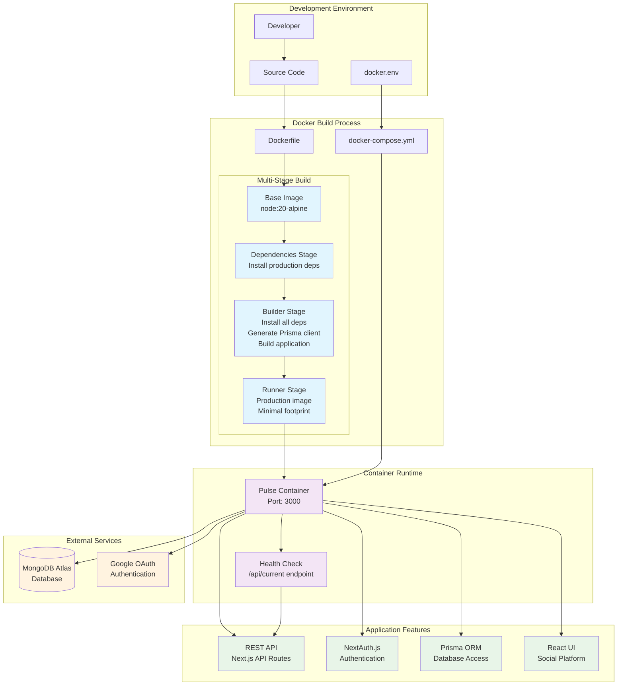
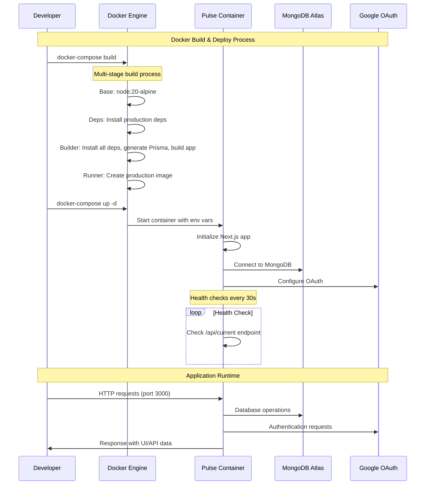
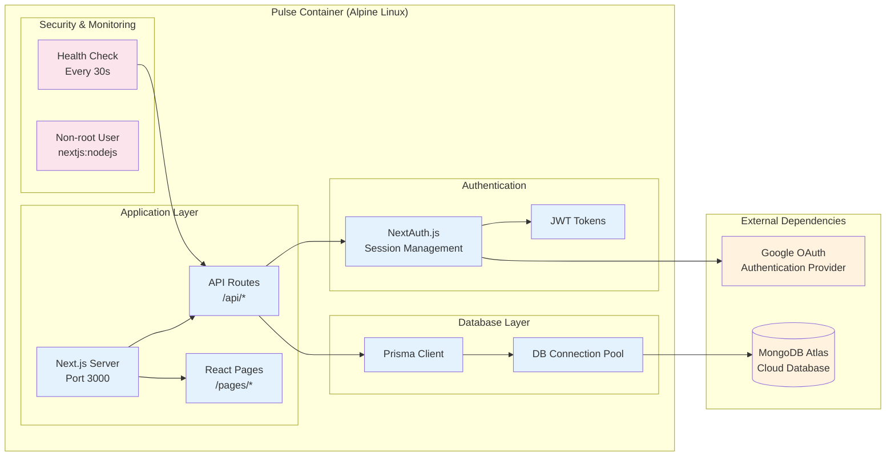
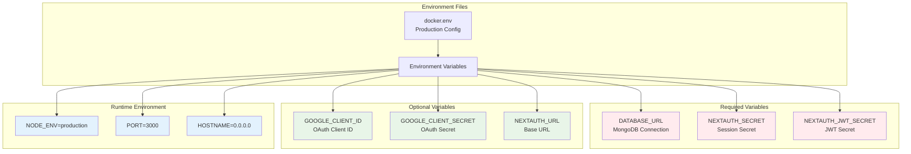

# Docker Architecture Diagram

This diagram illustrates the Docker setup and deployment process for the Pulse social platform application.

## Docker Process Flow

## Docker Commands Flow

## Container Architecture

## Environment Configuration

## Key Features

### Multi-Stage Build Process

- **Base Stage**: Uses Node.js 20 Alpine for compatibility
- **Dependencies Stage**: Installs only production dependencies
- **Builder Stage**: Installs all dependencies, generates Prisma client, builds the application
- **Runner Stage**: Creates minimal production image with only necessary files

### Security Features

- Runs as non-root user (`nextjs:nodejs`)
- Proper file permissions and ownership
- Minimal Alpine Linux base image
- Health checks for monitoring

### Performance Optimizations

- Leverages Next.js standalone output
- Optimized layer caching
- Native module support (bcrypt, etc.)
- Proper static file handling

### External Integrations

- MongoDB Atlas for database storage
- Google OAuth for authentication
- Health check endpoint for monitoring
