# Pulse Microservices Architecture - Senior Architect Analysis & Recommendations

## Overview

This document provides a comprehensive analysis of the proposed microservices architecture for the Pulse social platform, including current system evaluation, migration challenges, and detailed recommendations for optimal technology choices and implementation strategy.

## Current System Analysis

### **Existing Architecture (Monolithic)**

- **Frontend**: Next.js with React, TypeScript, Tailwind CSS
- **Backend**: Next.js API routes (monolithic structure)
- **Database**: MongoDB with Prisma ORM
- **Authentication**: NextAuth.js with JWT + OAuth (Google)
- **Current Services**: Posts, Events, Chat, Users, Notifications, Comments, Follow system

### **Migration Challenges Identified**

1. **Authentication Integration**: Current NextAuth.js vs proposed Java Spring OAuth2
2. **Database Migration**: MongoDB to PostgreSQL transition complexity
3. **Service Coupling**: Tightly coupled features in current monolithic structure
4. **Data Consistency**: Cross-service data dependencies (user data in posts, events, chat)

## Proposed Architecture Analysis

### **Strengths of Proposed Design**

✅ **Technology Optimization**: Go for Chat service (excellent for real-time messaging)  
✅ **Clear Service Boundaries**: Good separation of concerns  
✅ **Event-Driven Architecture**: RabbitMQ for inter-service communication  
✅ **Caching Strategy**: Redis for performance optimization  
✅ **Database per Service**: Proper microservices pattern

### **Critical Issues & Recommendations**

#### **1. Authentication Strategy**

**Issue**: Conflict between current NextAuth.js and proposed Java Spring OAuth2  
**Recommendation**: Keep NextAuth.js as authentication gateway, validate JWT in microservices  
**Rationale**: Maintains current OAuth integration, easier migration path

#### **2. Database Strategy**

**Issue**: Complex migration from MongoDB to PostgreSQL  
**Recommendation**: Phase 1 - Keep MongoDB for all services, Phase 2 - Migrate User Service to PostgreSQL  
**Rationale**: Reduces migration complexity, maintains current Prisma setup

#### **3. Service Boundaries**

**Issue**: Cross-service data consistency challenges  
**Recommendation**: Implement shared user data service or event-driven synchronization  
**Rationale**: Ensures data consistency across services

## Recommended Architecture

### **Revised Technology Stack**

| Service            | Current     | Proposed             | **Recommended**                  | Rationale                                |
| ------------------ | ----------- | -------------------- | -------------------------------- | ---------------------------------------- |
| **User Service**   | Next.js API | Java Spring + OAuth2 | **Node.js + Express + NextAuth** | Maintains current auth, easier migration |
| **Social Service** | Next.js API | Node.js + Express    | **Node.js + Express**            | ✅ Good choice                           |
| **Chat Service**   | Next.js API | Go + Gin             | **Go + Gin**                     | ✅ Excellent for real-time               |
| **Media Service**  | None        | Node.js + Express    | **Node.js + Express**            | ✅ Good choice                           |

### **Database Strategy**

- **Phase 1**: Keep MongoDB for all services (easier migration)
- **Phase 2**: Migrate User Service to PostgreSQL (better ACID compliance)

### **Authentication Architecture**

```
NextAuth.js (Auth Gateway) → JWT Validation → Microservices
```

## Recommended Architecture Diagram

```mermaid
graph TB
    subgraph "Client Applications"
        WEB[🌐 Web App<br/>Next.js + React<br/>Current Implementation]
        MOBILE[📱 Mobile App<br/>Future Implementation<br/>React Native]
    end

    subgraph "API Gateway Layer"
        GATEWAY[🌐 Nginx Gateway<br/>Load Balancing<br/>SSL Termination<br/>Rate Limiting]
    end

    subgraph "Authentication Service"
        AUTH[🔐 NextAuth Service<br/>JWT + OAuth<br/>Google Integration<br/>Port: 3000]
        AUTHDATA[(Auth Data<br/>MongoDB<br/>User Sessions)]
    end

    subgraph "Core Microservices"
        USER[👤 User Service<br/>Node.js + Express<br/>Port: 3001<br/>JWT Validation]
        SOCIAL[📝 Social Service<br/>Node.js + Express<br/>Port: 3002<br/>Posts, Events, Comments]
        CHAT[💬 Chat Service<br/>Go + Gin<br/>Port: 3003<br/>WebSocket + Real-time]
        MEDIA[📸 Media Service<br/>Node.js + Express<br/>Port: 3004<br/>File Upload + CDN]
    end

    subgraph "Databases (Phase 1)"
        USERDB[(User DB<br/>MongoDB<br/>User Profiles)]
        SOCIALDB[(Social DB<br/>MongoDB<br/>Posts, Events)]
        CHATDB[(Chat DB<br/>MongoDB<br/>Messages, Chats)]
        FILESTORE[(File Storage<br/>AWS S3<br/>Media Files)]
    end

    subgraph "Infrastructure"
        REDIS[(🔴 Redis Cluster<br/>Cache + Sessions<br/>Real-time Pub/Sub)]
        QUEUE[(📨 RabbitMQ Cluster<br/>Event Bus<br/>Service Communication)]
    end

    %% Client connections
    WEB --> GATEWAY
    MOBILE --> GATEWAY

    %% Gateway to services
    GATEWAY --> AUTH
    GATEWAY --> USER
    GATEWAY --> SOCIAL
    GATEWAY --> CHAT
    GATEWAY --> MEDIA

    %% Authentication service
    AUTH --> AUTHDATA
    AUTH -.->|JWT Validation| USER
    AUTH -.->|JWT Validation| SOCIAL
    AUTH -.->|JWT Validation| CHAT
    AUTH -.->|JWT Validation| MEDIA

    %% Services to databases
    USER --> USERDB
    SOCIAL --> SOCIALDB
    CHAT --> CHATDB
    MEDIA --> FILESTORE

    %% Shared infrastructure connections
    USER -.->|Cache| REDIS
    SOCIAL -.->|Cache| REDIS
    CHAT -.->|Cache & Pub/Sub| REDIS
    MEDIA -.->|Cache| REDIS
    AUTH -.->|Sessions| REDIS

    USER -.->|Events| QUEUE
    SOCIAL -.->|Events| QUEUE
    CHAT -.->|Events| QUEUE
    MEDIA -.->|Events| QUEUE

    %% Styling
    classDef client fill:#e3f2fd,stroke:#1976d2,stroke-width:2px
    classDef gateway fill:#f3e5f5,stroke:#7b1fa2,stroke-width:2px
    classDef service fill:#e8f5e8,stroke:#388e3c,stroke-width:2px
    classDef database fill:#fff3e0,stroke:#f57c00,stroke-width:2px
    classDef infra fill:#fce4ec,stroke:#c2185b,stroke-width:2px

    class WEB,MOBILE client
    class GATEWAY gateway
    class AUTH,USER,SOCIAL,CHAT,MEDIA service
    class USERDB,SOCIALDB,CHATDB,FILESTORE,AUTHDATA database
    class REDIS,QUEUE infra
```



## Implementation Strategy

### **Phase 1: Foundation (Weeks 1-4)**

1. **Setup Infrastructure**
   - Docker containers for each service
   - Nginx gateway configuration
   - Redis and RabbitMQ setup
   - MongoDB database setup

2. **Authentication Service**
   - Keep existing NextAuth.js
   - Add JWT validation middleware for microservices
   - Maintain Google OAuth integration

3. **User Service Migration**
   - Extract user-related API routes from Next.js
   - Create Node.js + Express service
   - Implement JWT validation
   - Migrate user database operations

### **Phase 2: Core Services (Weeks 5-8)**

1. **Social Service**
   - Extract posts, events, comments functionality
   - Implement event-driven architecture
   - Add caching with Redis

2. **Chat Service**
   - Build Go + Gin service
   - Implement WebSocket connections
   - Real-time messaging functionality

### **Phase 3: Advanced Features (Weeks 9-12)**

1. **Media Service**
   - File upload functionality
   - AWS S3 integration
   - CDN setup

2. **Optimization**
   - Performance monitoring
   - Database optimization
   - Caching strategies

## Architecture Components

### **1. Client Applications**

- **Web App**: Next.js SPA with React frontend (current implementation)
- **Mobile App**: Future React Native implementation

### **2. API Gateway Layer**

- **Nginx Gateway**: Load balancing, SSL termination, rate limiting
- **Request Routing**: Route requests to appropriate microservices

### **3. Authentication Service**

- **NextAuth Service**: JWT + OAuth integration (maintained from current system)
- **JWT Validation**: Microservices validate tokens from NextAuth
- **Supported Providers**: Google OAuth (current), extensible for others

### **4. Core Microservices**

- **User Service** (Node.js + Express): User profiles, following, search, JWT validation
- **Social Service** (Node.js + Express): Posts, events, comments, likes, feeds
- **Chat Service** (Go + Gin): Real-time messaging with WebSocket, goroutines
- **Media Service** (Node.js + Express): File upload, AWS S3 integration, CDN

### **5. Database Strategy**

- **Phase 1**: MongoDB for all services (easier migration)
- **Phase 2**: PostgreSQL for User Service (better ACID compliance)
- **Database per Service**: Each microservice owns its data

### **6. Infrastructure Components**

- **Redis**: Caching, session storage, real-time pub/sub
- **RabbitMQ**: Event bus for asynchronous service communication
- **AWS S3**: File storage for media
- **Docker**: Service containerization

## Key Architectural Patterns

### **1. API Gateway Pattern**

- Single entry point for all client requests
- Request routing and load balancing
- SSL termination and rate limiting

### **2. Event-Driven Architecture**

- Asynchronous communication via RabbitMQ
- Loose coupling between services
- Event sourcing for audit trails

### **3. Database per Service**

- Each microservice owns its data
- MongoDB for all services initially (easier migration)
- PostgreSQL for User Service in Phase 2 (better ACID compliance)

### **4. JWT-Based Authentication**

- Centralized authentication with NextAuth.js
- Stateless JWT validation in microservices
- Maintains current OAuth integration

### **5. Circuit Breaker Pattern**

- Fault tolerance between services
- Graceful degradation
- Health checks and monitoring

## Migration Challenges & Solutions

### **Challenge 1: Authentication Integration**

**Problem**: Current NextAuth.js vs proposed Java Spring OAuth2  
**Solution**: Keep NextAuth.js as authentication gateway, validate JWT in microservices  
**Benefits**: Maintains current OAuth integration, easier migration path

### **Challenge 2: Database Migration**

**Problem**: Complex migration from MongoDB to PostgreSQL  
**Solution**: Phase 1 - Keep MongoDB for all services, Phase 2 - Migrate User Service to PostgreSQL  
**Benefits**: Reduces migration complexity, maintains current Prisma setup

### **Challenge 3: Service Coupling**

**Problem**: Tightly coupled features in current monolithic structure  
**Solution**: Implement event-driven data synchronization and shared user data service  
**Benefits**: Ensures data consistency across services

### **Challenge 4: Cross-Service Data Dependencies**

**Problem**: User data needed in posts, events, chat services  
**Solution**: Event-driven data synchronization and caching strategies  
**Benefits**: Maintains data consistency while enabling service independence

## Scalability Features

### **Horizontal Scaling**

- Docker containerization for easy scaling
- Load balancer distribution
- Stateless services design

### **Database Scaling**

- MongoDB sharding for large datasets
- Read replicas for read-heavy operations
- Connection pooling

### **Caching Strategy**

- Redis for session storage and caching
- CDN for media files
- Application-level caching

## Security Considerations

### **Authentication**

- JWT tokens with NextAuth.js (maintained)
- OAuth integration with Google (current)
- Session management via Redis

### **Authorization**

- JWT validation in each microservice
- Service-to-service authentication
- API rate limiting at gateway level

### **Network Security**

- TLS/SSL encryption
- Service isolation via Docker
- Network policies

## Performance Optimizations

### **Real-time Features**

- WebSocket connections for chat (Go service)
- Redis pub/sub for real-time updates
- Event-driven notifications

### **Caching**

- Multi-level caching strategy with Redis
- CDN for media files
- Database query optimization

### **Load Balancing**

- Nginx round-robin distribution
- Health check integration
- Failover mechanisms

## Risk Assessment & Mitigation

### **High Risk**

1. **Authentication Migration**: Keep NextAuth.js to mitigate
2. **Database Migration**: Use MongoDB initially to mitigate
3. **Service Coupling**: Implement event-driven architecture to mitigate

### **Medium Risk**

1. **Performance**: Implement caching and monitoring
2. **Data Consistency**: Use event-driven synchronization
3. **Deployment Complexity**: Use Docker for containerization

### **Low Risk**

1. **Technology Learning**: Team familiar with Node.js, Go learning curve manageable
2. **Infrastructure**: Use managed services (MongoDB Atlas, Redis Cloud)

## Success Metrics

### **Technical Metrics**

- Response time < 200ms for API calls
- 99.9% uptime for each service
- < 1% error rate across services

### **Business Metrics**

- Successful migration of all current functionality
- Improved scalability (support 1000+ concurrent users)
- Reduced deployment time and complexity

This architecture demonstrates:

- **Practical Migration Strategy**: Builds on existing system strengths
- **Risk Mitigation**: Addresses major migration challenges
- **Technology Optimization**: Uses best tools for each service
- **Scalable Design**: Supports future growth and expansion
- **Security Best Practices**: Maintains current security model
- **Performance Focus**: Optimized for response time and efficiency
