# Twitter Clone App Architecture

```mermaid
graph TB
    %% Frontend Layer
    subgraph "Frontend (Next.js)"
        subgraph "Pages"
            Home["🏠 Home (/)"]
            UserProfile["👤 User Profile (/users/[username])"]
            PostDetail["📝 Post Detail (/posts/[postId])"]
            Notifications["🔔 Notifications (/notifications)"]
            Followers["👥 Followers (/users/[username]/followers)"]
            Following["👥 Following (/users/[username]/following)"]
        end

        subgraph "Components"
            Layout["📱 Layout"]
            Sidebar["📋 Sidebar"]
            ActionSidebar["⚡ ActionSidebar"]
            PostForm["✍️ PostForm"]
            PostFeeds["📰 PostFeeds"]
            PostFeed["📄 PostFeed"]
            CommentFeed["💬 CommentFeed"]
            UserHero["🦸 UserHero"]
            UserInfo["ℹ️ UserInfo"]
            WhoToFollow["👥 WhoToFollow"]
            NotificationFeed["🔔 NotificationFeed"]
        end

        subgraph "Modals"
            LoginModal["🔐 LoginModal"]
            RegisterModal["📝 RegisterModal"]
            EditModal["✏️ EditModal"]
            TweetModal["🐦 TweetModal"]
        end

        subgraph "Hooks (State Management)"
            useCurrentUser["👤 useCurrentUser"]
            usePosts["📰 usePosts"]
            useLikes["❤️ useLikes"]
            useFollow["👥 useFollow"]
            useNotifications["🔔 useNotifications"]
            useSearch["🔍 useSearch"]
        end
    end

    %% API Layer
    subgraph "API Routes (Next.js API)"
        subgraph "Authentication"
            NextAuth["🔐 NextAuth ([...nextauth])"]
            CurrentUser["👤 /api/current"]
            Register["📝 /api/register"]
        end

        subgraph "Posts"
            PostsAPI["📰 /api/posts"]
            PostDetailAPI["📝 /api/posts/[postId]"]
            CommentsAPI["💬 /api/comments"]
            LikesAPI["❤️ /api/likes"]
        end

        subgraph "Users"
            UsersAPI["👤 /api/users"]
            UserProfileAPI["👤 /api/users/[username]"]
            CheckUsername["✅ /api/users/check-username"]
            FollowAPI["👥 /api/follow"]
            FollowingAPI["👥 /api/following"]
        end

        subgraph "Other"
            SearchAPI["🔍 /api/search"]
            EditAPI["✏️ /api/edit"]
            NotificationsAPI["🔔 /api/notifications/[userId]"]
        end
    end

    %% Database Layer
    subgraph "Database (MongoDB + Prisma)"
        subgraph "Models"
            UserModel["👤 User"]
            PostModel["📰 Post"]
            CommentModel["💬 Comment"]
            NotificationModel["🔔 Notification"]
        end

        PrismaClient["🗄️ Prisma Client"]
        MongoDB["🍃 MongoDB"]
    end

    %% External Services
    subgraph "External Services"
        NextAuthProvider["🔐 NextAuth.js"]
        SWR["📡 SWR (Data Fetching)"]
        VercelAnalytics["📊 Vercel Analytics"]
    end

    %% Data Flow Connections
    Home --> Layout
    UserProfile --> Layout
    PostDetail --> Layout
    Notifications --> Layout
    Followers --> Layout
    Following --> Layout

    Layout --> Sidebar
    Layout --> ActionSidebar

    Home --> PostForm
    Home --> PostFeeds
    PostFeeds --> PostFeed
    PostDetail --> CommentFeed

    UserProfile --> UserHero
    UserProfile --> UserInfo
    UserProfile --> PostFeeds

    %% Hooks to Components
    useCurrentUser --> Layout
    useCurrentUser --> PostForm
    useCurrentUser --> PostFeeds
    usePosts --> PostFeeds
    useLikes --> PostFeed
    useFollow --> UserInfo
    useNotifications --> NotificationFeed
    useSearch --> ActionSidebar

    %% API Connections
    useCurrentUser --> CurrentUser
    usePosts --> PostsAPI
    useLikes --> LikesAPI
    useFollow --> FollowAPI
    useNotifications --> NotificationsAPI
    useSearch --> SearchAPI

    %% Authentication Flow
    LoginModal --> NextAuth
    RegisterModal --> Register
    NextAuth --> NextAuthProvider

    %% Database Connections
    PostsAPI --> PrismaClient
    PostDetailAPI --> PrismaClient
    CommentsAPI --> PrismaClient
    LikesAPI --> PrismaClient
    UsersAPI --> PrismaClient
    UserProfileAPI --> PrismaClient
    FollowAPI --> PrismaClient
    FollowingAPI --> PrismaClient
    SearchAPI --> PrismaClient
    EditAPI --> PrismaClient
    NotificationsAPI --> PrismaClient
    CurrentUser --> PrismaClient
    Register --> PrismaClient

    PrismaClient --> UserModel
    PrismaClient --> PostModel
    PrismaClient --> CommentModel
    PrismaClient --> NotificationModel

    UserModel --> MongoDB
    PostModel --> MongoDB
    CommentModel --> MongoDB
    NotificationModel --> MongoDB

    %% External Service Connections
    useCurrentUser --> SWR
    usePosts --> SWR
    useLikes --> SWR
    useFollow --> SWR
    useNotifications --> SWR
    useSearch --> SWR

    %% Styling
    classDef frontend fill:#e1f5fe
    classDef api fill:#f3e5f5
    classDef database fill:#e8f5e8
    classDef external fill:#fff3e0

    class Home,UserProfile,PostDetail,Notifications,Followers,Following,Layout,Sidebar,ActionSidebar,PostForm,PostFeeds,PostFeed,CommentFeed,UserHero,UserInfo,WhoToFollow,NotificationFeed,LoginModal,RegisterModal,EditModal,TweetModal,useCurrentUser,usePosts,useLikes,useFollow,useNotifications,useSearch frontend

    class NextAuth,CurrentUser,Register,PostsAPI,PostDetailAPI,CommentsAPI,LikesAPI,UsersAPI,UserProfileAPI,CheckUsername,FollowAPI,FollowingAPI,SearchAPI,EditAPI,NotificationsAPI api

    class UserModel,PostModel,CommentModel,NotificationModel,PrismaClient,MongoDB database

    class NextAuthProvider,SWR,VercelAnalytics external
```

## Architecture Overview

This Twitter clone application follows a modern full-stack architecture with the following key components:

### Frontend Layer

- **Next.js Pages**: Server-side rendered pages for different routes
- **React Components**: Reusable UI components organized by functionality
- **Custom Hooks**: State management and data fetching using SWR
- **Modals**: Authentication and interaction modals

### API Layer

- **Next.js API Routes**: RESTful endpoints for backend functionality
- **Authentication**: NextAuth.js integration with credentials provider
- **CRUD Operations**: Full CRUD for posts, users, comments, and notifications

### Database Layer

- **Prisma ORM**: Type-safe database access
- **MongoDB**: NoSQL database for flexible data storage
- **Models**: User, Post, Comment, and Notification entities

### Key Features

- User authentication and registration
- Post creation, liking, and commenting
- User following system
- Real-time notifications
- User profiles and search functionality
- Responsive design with Tailwind CSS

### Data Flow

1. User interactions trigger hooks
2. Hooks make API calls using SWR
3. API routes process requests and interact with Prisma
4. Prisma queries MongoDB and returns data
5. Data flows back through the chain to update UI
