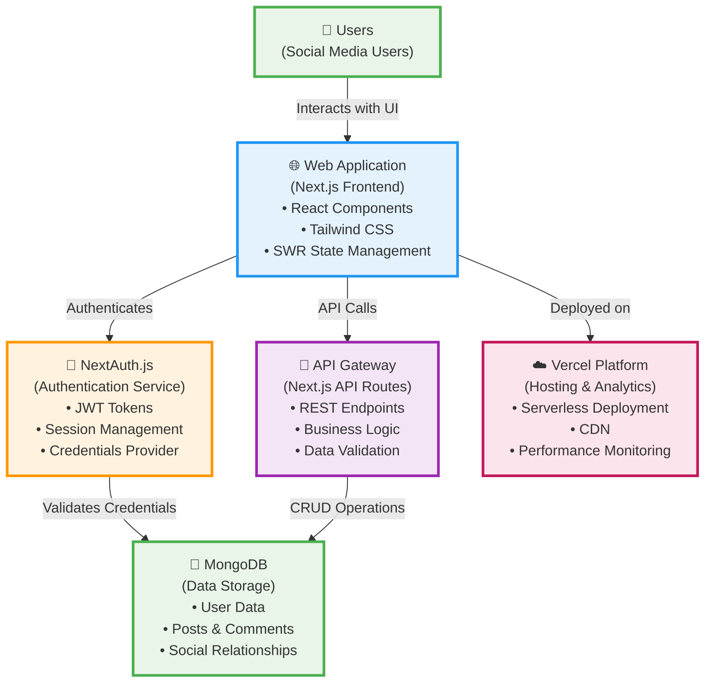

# Twitter Clone - C4 Containers Architecture

## 🏗️ Container Architecture

### **Core Containers:**

#### 🌐 **Web Application (Next.js Frontend)**

- **Technology**: Next.js, React, TypeScript
- **Responsibilities**:
  - User interface rendering
  - Client-side state management (SWR)
  - User interactions and routing
  - Responsive design (Tailwind CSS)

#### 🔐 **NextAuth.js (Authentication Service)**

- **Technology**: NextAuth.js with JWT strategy
- **Responsibilities**:
  - User authentication and authorization
  - Session management
  - Credential validation
  - Security token handling

#### 🔌 **API Gateway (Next.js API Routes)**

- **Technology**: Next.js API Routes, Prisma ORM
- **Responsibilities**:
  - RESTful API endpoints
  - Business logic implementation
  - Data validation and processing
  - Database interaction coordination

#### 🍃 **MongoDB (Data Storage)**

- **Technology**: MongoDB with Prisma ORM
- **Responsibilities**:
  - User profile and authentication data
  - Posts, comments, and social content
  - Following relationships and notifications
  - Data persistence and retrieval

#### ☁️ **Vercel Platform (External Service)**

- **Technology**: Vercel hosting platform
- **Responsibilities**:
  - Serverless application hosting
  - CDN and edge computing
  - Performance monitoring and analytics
  - Automatic scaling and deployment

### **Key Data Flows:**

1. **Authentication Flow**: User → WebApp → NextAuth → Database
2. **Content Flow**: User → WebApp → API Gateway → Database
3. **Deployment Flow**: WebApp → Vercel Platform
4. **Data Flow**: API Gateway ↔ Database (via Prisma)

### **Architecture Benefits:**

- 🔒 **Secure**: Dedicated authentication service with JWT
- 🚀 **Scalable**: Serverless containers with automatic scaling
- 🔄 **Maintainable**: Clear separation of concerns
- ⚡ **Performant**: Optimized data fetching and caching
- 📊 **Monitored**: Built-in analytics and performance tracking
